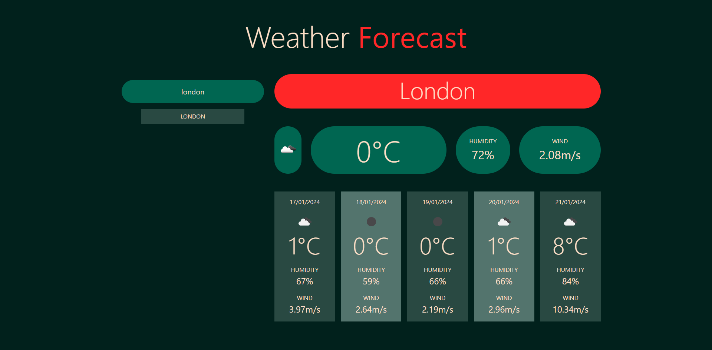

# :full_moon: About The Project

**Weather-Forecast** is a Web App for you to check the current weather forecast and up to five days for any city. This is the challenge of the week at the **edX Front-End Web Development Bootcamp**.

# :waxing_gibbous_moon: Features

- JavaScript
- Window localStorage
- Fetch API

# :first_quarter_moon: Screenshot

# :waxing_crescent_moon: Acceptance Criteria

- Create a weather dashboard with form inputs.
- When a user searches for a city they are presented with current and future conditions for that city
- City is added to the search history
- When a user views the current weather conditions for that city they are presented
- When a user view future weather conditions for that city they are presented with a 5-day forecast
- When a user click on a city in the search history they are again presented with current and future conditions for that city

# :new_moon: Technologies

- HTML
- CSS
- JAVASCRIPT
- JQUERY
- BOOTSTRAP

# :globe_with_meridians: Website

- [Weather-Forecast](https://whybruno.github.io/weather-forecast)

# :copyright: Credits

N/A

# :registered: License

MIT License